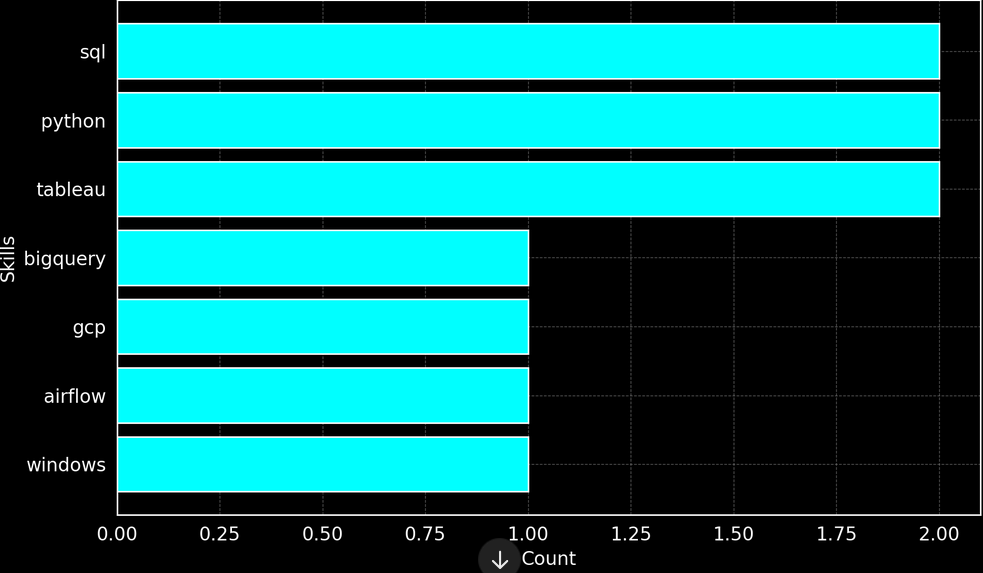

# Introduction
The project aims to analyze data on data analyst employment, focusing on salary levels and market demand. The outcome will highlight which skills are highly valued and in high demand on the job market.

Find the project files here [project_sql folder](/project_sql/)
# Backgroud
The data comes from the [SQL Course](https://lukebarousse.com/sql) on Luke Barousse's YouTube channel, and the analysis was done following the course's step-by-step guidance to learn SQL.

### Key Questions Addressed with SQL Queries:

1. What are the highest-paying data analyst roles?
2. Which skills are essential for these top-paying jobs?
3. What skills are most in demand for data analysts?
4. Which skills are associated with higher salaries?
5. What are the most valuable skills to learn for career growth?

# Tools I Used

 - **SQL:** Used for querying the database and extracting key insights.
 - **mySQL:** The database system for managing job posting data.
 - **Visual Studio Code:** My tool for managing and running SQL queries.
 - **Git & GitHub:** Used for version control and sharing my SQL scripts and analysis.

# The Analysis

### 1. Top Paying Data Analyst Jobs

To identify the highest-paying roles, I filtered data analyst positions based on average yearly salary and location (Poland). 
```sql
SELECT 
    job_id,
    job_title,
    job_location,
    job_schedule_type,
    salary_year_avg,
    job_posted_date,
    name AS company_name
FROM job_postings_fact
LEFT JOIN company_dim ON job_postings_fact.company_id = company_dim.company_id
WHERE 
    job_title_short = 'Data Analyst' AND 
    job_location = 'Poland' AND
    salary_year_avg IS NOT NULL
ORDER BY salary_year_avg DESC
LIMIT 10
```
Key Findings:

- **Wide Salary Range:** The top 10 highest-paying data analyst roles range from PLN 53,014 to PLN 111,175, showcasing the significant earning potential in this field.
- **Leading Employer:** The majority of the top-paying roles are offered by one company: Allegro.
- **Job Sectors:** Most of the high-paying positions are concentrated in the Financial Services and Pricing sectors.


*Bar graph visualizing the salary for the top 10 salaries for data analysts; ChatGPT generated this graph from my SQL query results*

### 2. Skills for Top Paying Jobs
To identify the skills required for the highest-paying roles, I joined the job postings with skills data.
```sql
WITH top_paying_jobs AS (
    SELECT 
        job_id,
        job_title,
        salary_year_avg,
        name AS company_name
    FROM job_postings_fact
    LEFT JOIN company_dim ON job_postings_fact.company_id = company_dim.company_id
    WHERE 
        job_title_short = 'Data Analyst' AND 
        job_location = 'Poland' AND
        salary_year_avg IS NOT NULL
    ORDER BY salary_year_avg DESC
    LIMIT 10
)

SELECT 
    top_paying_jobs.*,
    skills
FROM top_paying_jobs
INNER JOIN skills_job_dim ON top_paying_jobs.job_id = skills_job_dim.job_id
INNER JOIN skills_dim ON skills_job_dim.skill_id = skills_dim.skill_id
ORDER BY   
    salary_year_avg DESC
```

The most demanded skills for the top 10 highest paying data analyst jobs in 2023:
    SQL (9 offers)
    Google Cloud Platform (GCP) (7 offers)
    Python (5 offers)
    Tableau & Looker (4 offers)
    Excel and PySpark (2 offers)

- **SQL** is leading with a bold count of 9.
- **Google Cloud Platform (GCP)** follows closely with a bold count of 7.
- **Python** is also highly sought after, with a bold count of 5.
Other skills like **Tableau & LookerR** and **Excel and PySpark** show varying degrees of demand.


*Bar graph visualizing the count of skills for the top 10 paying jobs for data analysts; ChatGPT generated this graph from my SQL query results*

### 3. In-Demand Skills for Data Analysts

This query helped identify the skills most frequently requested in job postings.

```sql
SELECT 
    skills,
    COUNT(job_postings_fact.job_id) AS demand_count
FROM job_postings_fact 
INNER JOIN skills_job_dim ON job_postings_fact.job_id = skills_job_dim.job_id
INNER JOIN skills_dim ON skills_job_dim.skill_id = skills_dim.skill_id
WHERE
    job_title_short = 'Data Analyst' AND
    job_location = 'Poland'
GROUP BY skills
ORDER BY demand_count DESC
LIMIT 5
```
Here's the breakdown of the most demanded skills for data analysts in 2023
- **SQL** and **Excel** remain fundamental, emphasizing the need for strong foundational skills in data processing and spreadsheet manipulation.
- **Programming** and **Visualization Tools** like **Python**, **Tableau**, and **Power BI** are essential, pointing towards the increasing importance of technical skills in data storytelling and decision support.

| Skills   | Demand Count |
|----------|--------------|
| SQL      | 131          |
| Python   | 85           |
| Excel    | 73           |
| Tableau  | 56           |
| Power BI | 46           |

*Table of the demand for the top 5 skills in data analyst job postings*

### 4. Skills Based on Salary
Identifying the highest-paying skills.
```sql
SELECT 
    skills,
    ROUND(AVG(job_postings_fact.salary_year_avg),0) AS average_salary
FROM job_postings_fact 
INNER JOIN skills_job_dim ON job_postings_fact.job_id = skills_job_dim.job_id
INNER JOIN skills_dim ON skills_job_dim.skill_id = skills_dim.skill_id
WHERE
    job_title_short = 'Data Analyst' 
    AND salary_year_avg IS NOT NULL
    AND job_location = 'Poland'
GROUP BY skills
ORDER BY average_salary DESC
LIMIT 25
```

Here's a breakdown of the results for top paying skills for Data Analysts:

 - **Cloud & Big Data Expertise:** The highest salaries are offered to analysts with specialized skills in cloud technologies (BigQuery, GCP) and big data tools (Airflow, Spark, Hadoop). These skills are highly valued as they enable effective management and analysis of large-scale data sets in modern, cloud-based environments.

- **Proficiency in Python & SQL:** While Python and SQL are essential for data analysis, they alone do not guarantee the top earnings. However, these skills remain critical for building and manipulating data models, ensuring their continued demand in the industry.

- **Business Intelligence Tools:** Expertise in BI platforms such as Looker and Tableau is also highly lucrative, particularly for analysts who can drive data-driven decision-making and build interactive dashboards for stakeholders.

- **Less Lucrative Skills:** While tools like Excel and PowerPoint remain important, they are not associated with high-paying roles. Similarly, legal compliance knowledge (GDPR) and proficiency in office tools (SAP, PowerPoint) are generally linked to lower salaries in the data analytics field.

| Skills        | Average Salary (PLN) |
|---------------|---------------------:|
| bigquery      |	           111,175 |
| airflow       |	           111,175 |
| tableau       |	           109,006 |
| windows       |	           108,283 |
| spark         |	           102,500 |
| hadoop        |	           102,500 |
| scikit-learn  |	           102,500 |
| flow          |	           102,500 |
| git           |	           102,500 |
| looker        |	           99,979  |

*Table of the average salary for the top 10 paying skills for data analysts*

### 5. Most Optimal Skills to Learn

Combining the results of the two previous queries identifies which skills are both in high demand and offer the highest salaries.

```sql
SELECT
    skills_dim.skill_id,
    skills_dim.skills,
    COUNT(job_postings_fact.job_id) AS demand_count, 
    ROUND(AVG(job_postings_fact.salary_year_avg),0) AS average_salary
FROM job_postings_fact 
INNER JOIN skills_job_dim ON job_postings_fact.job_id = skills_job_dim.job_id
INNER JOIN skills_dim ON skills_job_dim.skill_id = skills_dim.skill_id
WHERE
    job_title_short = 'Data Analyst'
    AND job_location = 'Poland'
    AND salary_year_avg IS NOT NULL
GROUP BY 
    skills_dim.skill_id
HAVING COUNT(job_postings_fact.job_id) > 0
ORDER BY 
    average_salary DESC,
    demand_count DESC
```

| Skills        | Demand Count | Average Salary (PLN) |
|---------------|--------------|---------------------:|
| bigquery      |            1 |              111,175 |
| airflow       |            1 |              111,175 |
| tableau       |            4 |              109,006 |
| windows       |            3 |              108,283 |
| spark         |            1 |              102,500 |
| hadoop        |            1 |              102,500 |
| scikit-learn  |            1 |              102,500 |
| flow          |            1 |              102,500 |
| git           |            1 |              102,500 |
| looker        |            4 |               99,979 |

*Table of the most optimal skills for data analyst sorted by salary*

Here's a breakdown of the most optimal skills for Data Analysts based on the recent data:

- **High-Demand Big Data and Cloud Tools:** BigQuery and Airflow emerge as top-paying skills, both with an average salary of 111,175. These technologies are in high demand, highlighting the growing need for expertise in cloud computing and big data processing for data analysts.

- **Business Intelligence and Visualization Tools:** Tableau and Looker stand out for their demand, with Tableau having a demand count of 4 and Looker also being sought after. Their average salaries of 109,006 and 99,979, respectively, underline the importance of data visualization tools in helping organizations make data-driven decisions.

- **Big Data Technologies:** Spark, Hadoop, and Scikit-learn all have an average salary of 102,500, indicating that proficiency in big data tools and machine learning libraries is critical for analysts handling complex data processing and predictive analytics.

- **Essential Programming Languages:** Python and SQL remain integral to the role of data analysts, with Python earning an average salary of 96,073 and SQL at 86,347. While essential, these skills are not as high-paying as the more specialized tools but are crucial for effective data manipulation and querying.

- **Office Tools and Compliance Knowledge:** Excel, SAP, PowerPoint, and GDPR have lower demand and salary levels, with Excel earning an average of 74,239 and SAP/PowerPoint around 60,109. These skills remain important but are not as lucrative as more advanced technical capabilities.

# What I Learned

- SQL fundamentals
- Writing complex SQL queries
- Data aggregation and analysis
- Extracting insights from raw data
- Using Git for version control

# Conclusion

### Insights

1. **Top-Paying Data Analyst Jobs:** The highest-paying jobs for data analysts in Poland range from PLN 53,014 to PLN 111,175 per year. Most of these positions are offered by Allegro and are concentrated in the Financial Services and Pricing sectors.

2. **Most Valuable Skills for Top Salaries:**

- SQL (9 offers) is the most required skill for high-paying data analyst jobs.

- Google Cloud Platform (7 offers) and Python (5 offers) are also highly valued.

- Business intelligence tools like Tableau, Looker, and PySpark appear in several high-paying job postings.

3. **Most In-Demand Skills for Data Analysts:**

- SQL (131 job postings) is the most demanded skill.

- Python (85 job postings) and Excel (73 job postings) remain essential for data analysts.

- Tableau (56 job postings) and Power BI (46 job postings) are the most requested visualization tools.

4. **Highest-Paying Skills:**

- Cloud and big data expertise (BigQuery, Airflow, Spark, Hadoop) command the highest salaries (PLN 102,500+).

- Business intelligence tools like Tableau and Looker also yield lucrative salaries (PLN 99,979+).

- While SQL and Python are widely used, they do not guarantee the highest salaries alone but remain fundamental to the role.

5. **Most Optimal Skills to Learn:**

- To maximize salary potential, data analysts should focus on BigQuery, Airflow, Tableau, Spark, Hadoop, and Looker.

- Developing expertise in SQL, Python, and BI tools ensures high demand and competitive salaries.

- Less lucrative but still important skills include Excel, SAP, and PowerPoint.

### Final Thoughts

Through this project, I gained hands-on experience in SQL by analyzing real-world job data. The results confirm that SQL, Python, and BI tools are essential for data analysts, while cloud computing and big data technologies provide the best salary growth opportunities.

By focusing on high-demand and high-paying skills, data analysts can strategically advance their careers and secure top-paying roles in the job market.